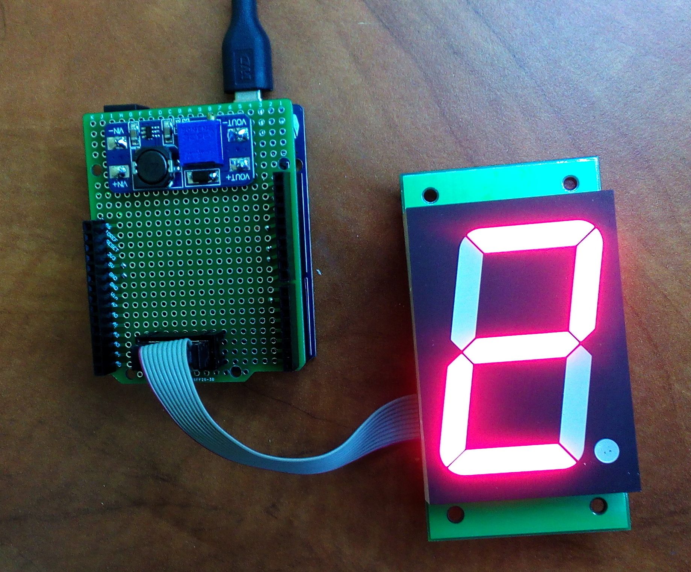
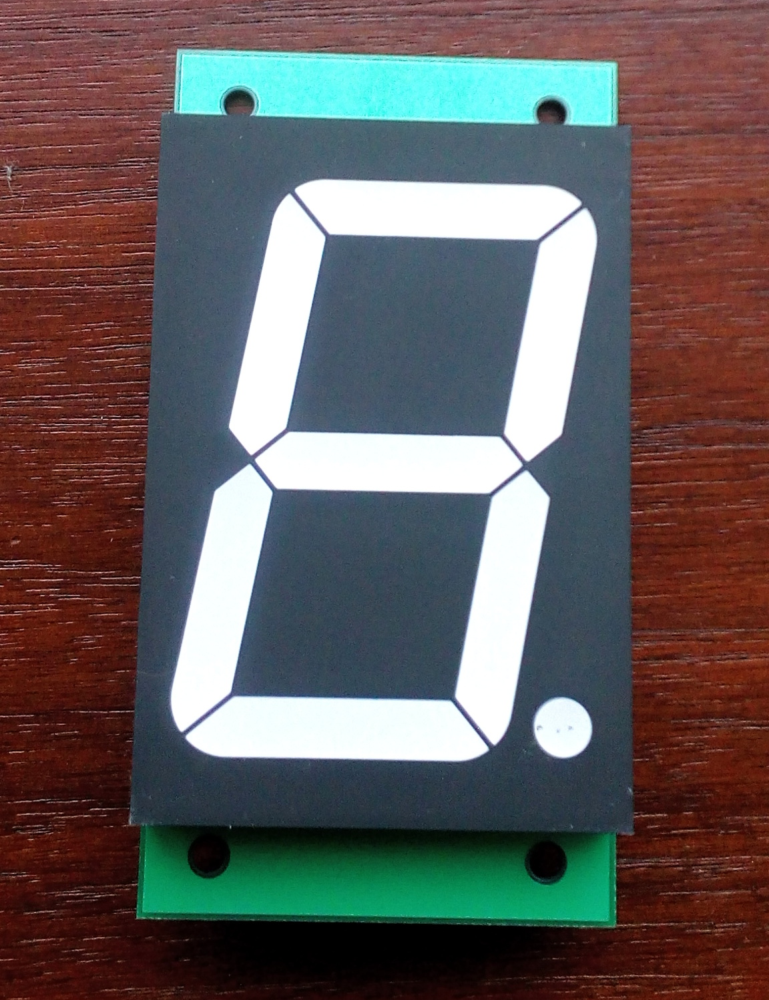
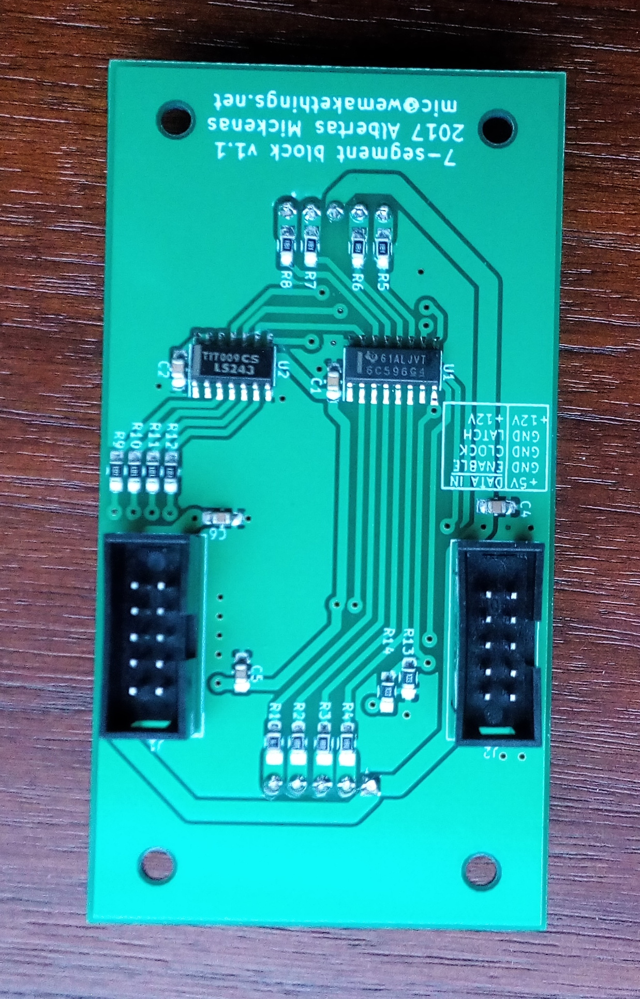

# 7-segment-block

A big 7 segment plug and play module designed to be easily chainable and be driven by SPI bus.







```Arduino
#include<SPI.h>
#include <Bounce2.h>

#define ZERO  0b11101110
#define ONE   0b10000010
#define TWO   0b11011100
#define THREE 0b11010110
#define FOUR  0b10110010
#define FIVE  0b01110110
#define SIX   0b01111110
#define SEVEN 0b11000010
#define EIGHT 0b11111110
#define NINE  0b11110110
#define DARK  0b00000000

uint8_t digits[] = {ZERO, ONE, TWO, THREE, FOUR, FIVE, SIX, SEVEN, EIGHT, NINE, DARK};
uint8_t brightness = 0;

void setup() {
  Serial.begin(9600);
  randomSeed(analogRead(0));
  
  //Output enable
  pinMode(6, OUTPUT);  
  digitalWrite(6, HIGH);
 
  //Latch
  pinMode(10, OUTPUT);
  digitalWrite(10, HIGH);
 
  //MOSI
  pinMode(11, OUTPUT);
  
  //SCK
  pinMode(13, OUTPUT);

  SPI.begin();
  SPI.setDataMode(SPI_MODE0);
  digitalWrite(6, LOW);  
}

void displayDigit(uint8_t digit1) {
    digitalWrite(10, LOW);
    SPI.transfer(digit1);
    digitalWrite(10, HIGH);  
}

uint8_t i = 0;

void loop() {
  displayDigit(digits[i]);
  i++;
  if(i > 9) {
    i = 0; 
  }
  while(brightness++ < 254) {
    analogWrite(6, brightness++);
    delay(10);   
  }
  brightness = 0;
  delay(10);
}

```
